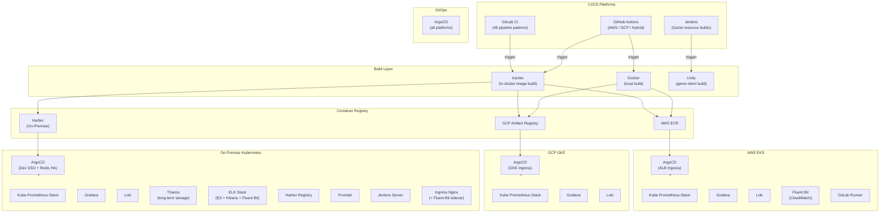
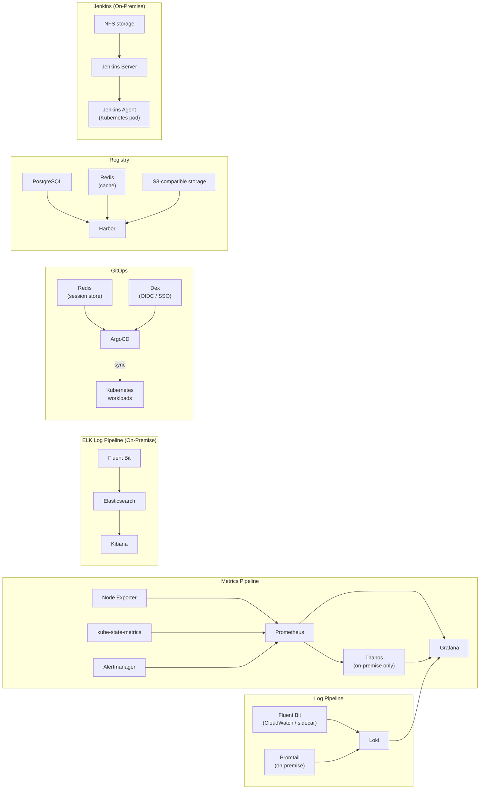
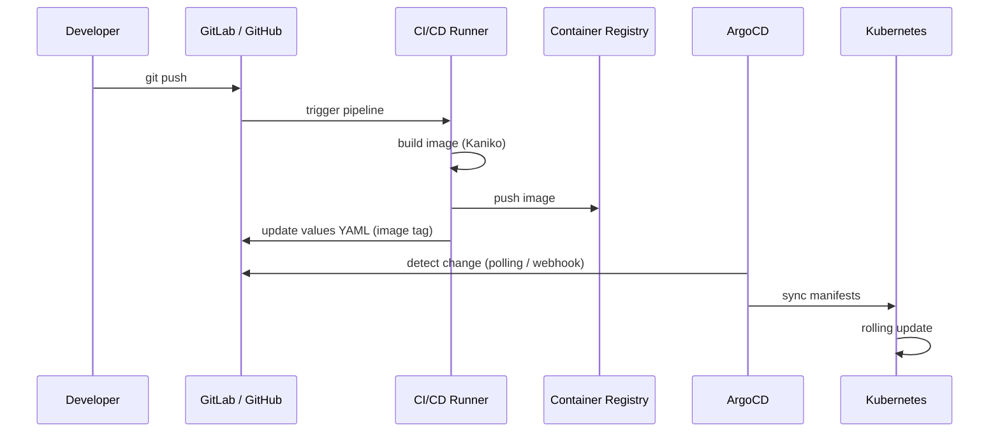

# Architecture Overview

 

## Platform Architecture

This repository covers three deployment environments, each with a full CI/CD and monitoring stack.

 

## Component Dependency Graph

 

## Network Flow

 

## Storage Architecture

| Environment | Metrics | Logs | Registry | Persistence |
|-------------|---------|------|----------|-------------|
| **AWS EKS** | EBS / EFS (Prometheus) | S3 (Loki) | AWS ECR | EBS / EFS (ReadWriteMany) |
| **GCP GKE** | PD (Prometheus) | GCS (Loki) | Artifact Registry | Persistent Disk |
| **On-Premise** | NFS (Prometheus + Thanos) | NFS (Loki) | Harbor (NFS-backed) | NFS / local-path |

 

## Ingress Architecture

| Environment | Ingress Controller | TLS | Auth |
|-------------|-------------------|-----|------|
| **AWS EKS** | AWS ALB (group-based, shared) | ACM certificate | IAM / JWT |
| **GCP GKE** | GKE native ingress | Managed certificate | Workload Identity |
| **On-Premise** | ingress-nginx | cert-manager (Let's Encrypt) | Dex (GitLab SSO) |
